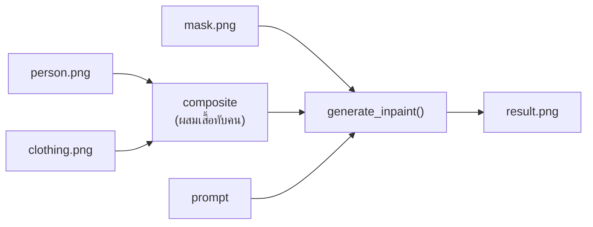
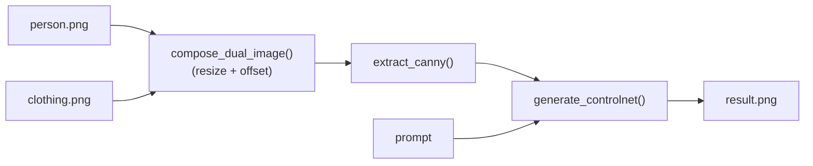

# GUIDE: Integrate Z-Image-Fun ControlNet + Inpaint into AI Toolkit

> เขียนไว้เมื่อ 2026-07-03  
> ใช้เป็น blueprint ให้ AI implement ทีหลัง

---

## สารบัญ

1. [ภาพรวม](#1-ภาพรวม)
2. [Installation](#2-installation)
3. [Model Files ที่ต้องมี](#3-model-files-ที่ต้องมี)
4. [File Structure ที่ต้องเพิ่ม](#4-file-structure-ที่ต้องเพิ่ม)
5. [Implementation: `core/zimage_fun.py`](#5-implementation-corezimage_funpy)
6. [Implementation: Endpoints ใน `main.py`](#6-implementation-endpoints-ใน-mainpy)
7. [Design Decisions](#7-design-decisions)
8. [Dual-Image Flow](#8-dual-image-flow)
9. [Testing & Verification](#9-testing--verification)

---

## 1. ภาพรวม

เพิ่ม Z-Image-Fun ControlNet pipeline (`ZImageControlPipeline`) เข้าไปใน AI Toolkit โดยไม่พึ่ง ComfyUI รองรับ 3 โหมด:

| Mode | Description | ใช้ตอนไหน |
|---|---|---|
| **ControlNet** | Text-to-image + control image (Canny/Pose/Depth) | เปลี่ยน background / style / structure |
| **Inpaint** | Image-to-image + mask | เปลี่ยนเฉพาะส่วนที่ mask ไว้ (เช่น เสื้อผ้า) |
| **Dual-Ref No-Mask** | 2 images (person + clothing) composite + Canny | มีแต่รูปคนกับเสื้อ ไม่มี mask |

**รองรับ 2 Model Versions:**
- **Standard**: Z-Image-Fun ControlNet Union 2.1 (25 steps, ~13GB VRAM)
- **Turbo**: Z-Image-Turbo-Fun + Distill LoRA (4 steps, ~10GB VRAM, CFG=1.0)

---

## 2. Installation

### 2.1 Clone VideoX-Fun

```bash
# Clone from GitHub
git clone https://github.com/aigc-apps/VideoX-Fun.git /tmp/videox-fun

# Install dependencies
cd /tmp/videox-fun
pip install -r requirements.txt

# Copy needed folders into project
cp -r videox_fun/ /Users/Shared/Jobs/u-11/ai-toolkit/
cp -r config/ /Users/Shared/Jobs/u-11/ai-toolkit/
```

> **Note**: VideoX-Fun **ไม่ได้ลงผ่าน PyPI** ต้อง clone มาวางในโปรเจคตรงๆ

### 2.2 เพิ่ม Dependencies ใน `requirements.txt`

```
omegaconf>=2.3.0
einops>=0.8.0
scikit-image>=0.24.0
albumentations>=1.4.0
```

ส่วนที่เหลือ (`torch`, `diffusers`, `transformers`, `safetensors`, `Pillow`, `accelerate`) มีอยู่แล้วใน requirements.txt เดิม

### 2.3 โครงสร้าง `videox_fun/` ที่คัดลอกมา

```
videox_fun/
├── __init__.py
├── pipeline/
│   ├── pipeline_z_image.py              # ZImagePipeline (base, ไม่ใช้)
│   └── pipeline_z_image_control.py      # ZImageControlPipeline (อันนี้ใช้!)
├── models/
│   ├── __init__.py
│   ├── autoencoder.py
│   ├── text_encoder.py
│   └── z_image_control_transformer.py
├── utils/
│   ├── lora_utils.py
│   ├── fp8_optimization.py
│   ├── fm_solvers.py
│   ├── fm_solvers_unipc.py
│   └── utils.py
└── dist.py
```

---

## 3. Model Files ที่ต้องมี

```
~/models/
├── Diffusion_Transformer/
│   └── Z-Image-Fun/                     ← base weights (from HuggingFace)
│       ├── transformer/
│       ├── vae/
│       ├── text_encoder/
│       ├── tokenizer/
│       └── scheduler/
└── Personalized_Model/
    ├── Z-Image-Fun-Controlnet-Union-2.1.safetensors   (จำเป็น)
    └── Z-Image-Fun-Lora-Distill-4-Steps-2603-ComfyUI.safetensors (optional, for turbo)
```

**Source**: https://huggingface.co/alibaba-pai/Z-Image-Fun-Lora-Distill

---

## 4. File Structure ที่ต้องเพิ่ม

```
ai-toolkit/
├── core/
│   ├── zimage.py          ← (มีอยู่แล้ว, Z-Image-Turbo ธรรมดา)
│   ├── zimage_fun.py      ← ★ ไฟล์ใหม่: Z-Image-Fun ControlNet + Inpaint
│   └── ...
├── videox_fun/            ← ★ ใหม่: คัดลอกจาก VideoX-Fun repo
├── config/
│   └── z_image/
│       └── z_image_control_2.1.yaml   ← ★ ใหม่: official config
├── main.py                ← เพิ่ม endpoints
└── requirements.txt       ← เพิ่ม deps
```

---

## 5. Implementation: `core/zimage_fun.py`

```python
"""
core/zimage_fun.py — Z-Image-Fun ControlNet + Inpaint pipeline
集成指南:
- โหลด ZImageControlPipeline จาก videox_fun.pipeline
- รองรับ control_image, inpaint_image, mask_image
- รองรับ turbo mode (distill LoRA 4-step)
"""

import os
import cv2
import torch
import numpy as np
from PIL import Image
from omegaconf import OmegaConf
from diffusers import FlowMatchEulerDiscreteScheduler
from safetensors.torch import load_file

from videox_fun.pipeline import ZImageControlPipeline
from videox_fun.models import (
    AutoencoderKL,
    AutoTokenizer,
    Qwen3ForCausalLM,
    ZImageControlTransformer2DModel,
)
from videox_fun.utils import register_auto_device_hook, safe_enable_group_offload
from videox_fun.utils.fm_solvers import FlowDPMSolverMultistepScheduler
from videox_fun.utils.fm_solvers_unipc import FlowUniPCMultistepScheduler
from videox_fun.utils.lora_utils import merge_lora, unmerge_lora
from videox_fun.utils.fp8_optimization import convert_model_weight_to_float8, convert_weight_dtype_wrapper
from videox_fun.utils.utils import get_image_latent

# ---------------------------------------------------------------------------
# Loading
# ---------------------------------------------------------------------------

def load_zimage_fun_pipeline(
    model_dir: str = None,
    controlnet_path: str = None,
    lora_path: str = None,
    lora_weight: float = 0.55,
    config_path: str = "config/z_image/z_image_control_2.1.yaml",
    weight_dtype: torch.dtype = torch.bfloat16,
    gpu_memory_mode: str = "model_cpu_offload",
    sampler_name: str = "Flow",
    on_message=None,
):
    """
    โหลด ZImageControlPipeline พร้อม ControlNet Union weights
    
    Args:
        model_dir: path ไปยัง Z-Image-Fun base model folder (ต้องมี transformer/, vae/, text_encoder/, tokenizer/, scheduler/)
        controlnet_path: path ไปยัง .safetensors ของ ControlNet Union
        lora_path: path ไปยัง distill LoRA (ถ้าใช้ turbo mode)
        lora_weight: น้ำหนัก LoRA (default 0.55)
        config_path: path ไปยัง yaml config
        weight_dtype: torch.bfloat16 (แนะนำ) หรือ torch.float16
        gpu_memory_mode: ดู options ด้านล่าง
        sampler_name: "Flow" | "Flow_Unipc" | "Flow_DPM++"
    """
    if model_dir is None:
        model_dir = os.path.expanduser("~/models/Diffusion_Transformer/Z-Image-Fun")
    
    if on_message:
        on_message("Loading config...")
    config = OmegaConf.load(config_path)
    
    # -- Transformer --
    if on_message:
        on_message("Loading transformer...")
    transformer = ZImageControlTransformer2DModel.from_pretrained(
        model_dir,
        subfolder="transformer",
        low_cpu_mem_usage=True,
        torch_dtype=weight_dtype,
        transformer_additional_kwargs=OmegaConf.to_container(config['transformer_additional_kwargs']),
    ).to(weight_dtype)
    
    # Load ControlNet weights
    if controlnet_path is None:
        controlnet_path = os.path.expanduser("~/models/Personalized_Model/Z-Image-Fun-Controlnet-Union-2.1.safetensors")
    
    if os.path.exists(controlnet_path):
        if on_message:
            on_message(f"Loading ControlNet: {os.path.basename(controlnet_path)}")
        state_dict = load_file(controlnet_path)
        state_dict = state_dict.get("state_dict", state_dict)
        m, u = transformer.load_state_dict(state_dict, strict=False)
        if on_message:
            on_message(f"ControlNet loaded: missing={len(m)}, unexpected={len(u)}")
    
    # -- VAE --
    if on_message:
        on_message("Loading VAE...")
    vae = AutoencoderKL.from_pretrained(model_dir, subfolder="vae").to(weight_dtype)
    
    # -- Tokenizer & Text Encoder --
    if on_message:
        on_message("Loading text encoder...")
    tokenizer = AutoTokenizer.from_pretrained(model_dir, subfolder="tokenizer")
    text_encoder = Qwen3ForCausalLM.from_pretrained(
        model_dir, subfolder="text_encoder", torch_dtype=weight_dtype, low_cpu_mem_usage=True,
    )
    
    # -- Scheduler --
    scheduler_map = {
        "Flow": FlowMatchEulerDiscreteScheduler,
        "Flow_Unipc": FlowUniPCMultistepScheduler,
        "Flow_DPM++": FlowDPMSolverMultistepScheduler,
    }
    scheduler = scheduler_map[sampler_name].from_pretrained(model_dir, subfolder="scheduler")
    
    # -- Pipeline --
    if on_message:
        on_message("Building pipeline...")
    pipeline = ZImageControlPipeline(
        vae=vae,
        tokenizer=tokenizer,
        text_encoder=text_encoder,
        transformer=transformer,
        scheduler=scheduler,
    )
    
    # -- Memory optimization --
    _apply_gpu_memory_mode(pipeline, transformer, gpu_memory_mode, weight_dtype)
    
    return pipeline, tokenizer, text_encoder


def _apply_gpu_memory_mode(pipeline, transformer, mode, dtype):
    """Apply GPU memory optimization strategy"""
    if mode == "sequential_cpu_offload":
        pipeline.enable_sequential_cpu_offload()
    elif mode == "model_group_offload":
        register_auto_device_hook(pipeline.transformer)
        safe_enable_group_offload(pipeline, onload_device="cuda", offload_device="cpu", offload_type="leaf_level", use_stream=True)
    elif mode == "model_cpu_offload_and_qfloat8":
        convert_model_weight_to_float8(transformer, exclude_module_name=["x_pad_token", "cap_pad_token"])
        convert_weight_dtype_wrapper(transformer, dtype)
        pipeline.enable_model_cpu_offload()
    elif mode == "model_cpu_offload":
        pipeline.enable_model_cpu_offload()
    elif mode == "model_full_load_and_qfloat8":
        convert_model_weight_to_float8(transformer, exclude_module_name=["x_pad_token", "cap_pad_token"])
        convert_weight_dtype_wrapper(transformer, dtype)
        pipeline.to("cuda")
    else:
        pipeline.to("cuda")


# ---------------------------------------------------------------------------
# Inference
# ---------------------------------------------------------------------------

@torch.no_grad()
def generate_controlnet(
    pipeline,
    prompt: str,
    control_image: Image.Image,
    negative_prompt: str = None,
    width: int = 1024,
    height: int = 1024,
    guidance_scale: float = 4.0,
    num_inference_steps: int = 25,
    control_context_scale: float = 0.90,
    seed: int = 42,
    lora_path: str = None,
    lora_weight: float = 0.55,
    weight_dtype=torch.bfloat16,
):
    """
    Text-to-image + ControlNet generation
    
    Args:
        control_image: รูป Canny / Pose / Depth ที่จะใช้เป็น control
    """
    device = pipeline.device
    generator = torch.Generator(device=device).manual_seed(seed)
    
    # Preprocess control image
    control_tensor = get_image_latent(control_image, sample_size=(height, width))[:, :, 0]
    
    # Apply LoRA ถ้ามี
    if lora_path is not None and os.path.exists(lora_path):
        pipeline = merge_lora(pipeline, lora_path, lora_weight, device=device, dtype=weight_dtype)
    
    # inpaint_image = zeros (ไม่ใช้ inpaint)
    inpaint_image = torch.zeros([1, 3, height, width])
    mask_image = torch.ones([1, 1, height, width]) * 255  # all-white = no mask
    
    sample = pipeline(
        prompt=prompt,
        negative_prompt=negative_prompt or "",
        height=height,
        width=width,
        generator=generator,
        guidance_scale=guidance_scale,
        image=inpaint_image,
        mask_image=mask_image,
        control_image=control_tensor,
        num_inference_steps=num_inference_steps,
        control_context_scale=control_context_scale,
    ).images
    
    if lora_path is not None:
        pipeline = unmerge_lora(pipeline, lora_path, lora_weight, device=device, dtype=weight_dtype)
    
    return sample[0]


@torch.no_grad()
def generate_inpaint(
    pipeline,
    prompt: str,
    base_image: Image.Image,
    mask_image: Image.Image,
    control_image: Image.Image = None,
    negative_prompt: str = None,
    width: int = 1024,
    height: int = 1024,
    guidance_scale: float = 4.0,
    num_inference_steps: int = 25,
    control_context_scale: float = 0.90,
    seed: int = 42,
    lora_path: str = None,
    lora_weight: float = 0.55,
    weight_dtype=torch.bfloat16,
):
    """
    Inpaint generation: เปลี่ยนเฉพาะส่วนที่ mask
    
    Args:
        base_image: รูปคน (background + คน)
        mask_image: รูป mask ขาว-ดำ (ขาว = ส่วนที่เปลี่ยน)
        control_image: (optional) Canny control เพื่อคง structure
    """
    device = pipeline.device
    generator = torch.Generator(device=device).manual_seed(seed)
    
    # Preprocess images
    inpaint_tensor = get_image_latent(base_image, sample_size=(height, width))[:, :, 0]
    mask_tensor = get_image_latent(mask_image, sample_size=(height, width))[:, :1, 0]
    
    if control_image is not None:
        control_tensor = get_image_latent(control_image, sample_size=(height, width))[:, :, 0]
    else:
        control_tensor = torch.zeros([1, 3, height, width])
    
    if lora_path is not None and os.path.exists(lora_path):
        pipeline = merge_lora(pipeline, lora_path, lora_weight, device=device, dtype=weight_dtype)
    
    sample = pipeline(
        prompt=prompt,
        negative_prompt=negative_prompt or "",
        height=height,
        width=width,
        generator=generator,
        guidance_scale=guidance_scale,
        image=inpaint_tensor,
        mask_image=mask_tensor,
        control_image=control_tensor,
        num_inference_steps=num_inference_steps,
        control_context_scale=control_context_scale,
    ).images
    
    if lora_path is not None:
        pipeline = unmerge_lora(pipeline, lora_path, lora_weight, device=device, dtype=weight_dtype)
    
    return sample[0]


# ---------------------------------------------------------------------------
# Dual-Image Helpers (Person + Clothing)
# ---------------------------------------------------------------------------

def compose_dual_image(
    person_img: Image.Image,
    cloth_img: Image.Image,
    offset_x: int = 0,
    offset_y: int = 50,
    resize_ratio: float = 0.8,
    canvas_size=(1024, 1024),
) -> Image.Image:
    """
    รวม 2 ภาพเป็นภาพเดียวแบบไม่ต้องใช้ mask:
    1. เอารูปคนเป็นพื้นหลัง (resize เต็ม canvas)
    2. เอารูปเสื้อวาง overlay โดย resize + offset
    
    ใช้สำหรับส่งเข้า controlnet mode (Canny) แทนการใช้ mask
    """
    canvas = Image.new("RGB", canvas_size)
    
    # Person image - resize to fill canvas
    person_resized = person_img.resize(canvas_size, Image.LANCZOS)
    canvas.paste(person_resized, (0, 0))
    
    # Clothing image - resize แล้ววางทับ
    cloth_w = int(cloth_img.width * resize_ratio)
    cloth_h = int(cloth_img.height * resize_ratio)
    cloth_resized = cloth_img.resize((cloth_w, cloth_h), Image.LANCZOS)
    
    # Composite (ใช้ alpha ถ้ามี)
    if cloth_resized.mode == "RGBA":
        canvas.paste(cloth_resized, (offset_x, offset_y), cloth_resized)
    else:
        canvas.paste(cloth_resized, (offset_x, offset_y))
    
    return canvas


def extract_canny(image: Image.Image, low_thresh=100, high_thresh=200) -> Image.Image:
    """Convert image to Canny edge map สำหรับใช้เป็น control_image"""
    img = np.array(image.convert("L"))
    edges = cv2.Canny(img, low_thresh, high_thresh)
    return Image.fromarray(edges).convert("RGB")


@torch.no_grad()
def generate_dual_nomask(
    pipeline,
    prompt: str,
    person_img: Image.Image,
    cloth_img: Image.Image,
    offset_x: int = 0,
    offset_y: int = 50,
    resize_ratio: float = 0.8,
    negative_prompt: str = None,
    width: int = 1024,
    height: int = 1024,
    guidance_scale: float = 4.0,
    num_inference_steps: int = 25,
    control_context_scale: float = 0.90,
    seed: int = 42,
    lora_path: str = None,
    lora_weight: float = 0.55,
    weight_dtype=torch.bfloat16,
) -> Image.Image:
    """
    Dual reference (person + clothing) **แบบไม่มี mask**:
    1. composite ทั้ง 2 ภาพ
    2. extract Canny edge
    3. ใช้ ControlNet เพื่อ generate
    """
    # Step 1: composite
    composite = compose_dual_image(
        person_img, cloth_img,
        offset_x=offset_x, offset_y=offset_y,
        resize_ratio=resize_ratio,
        canvas_size=(width, height),
    )
    
    # Step 2: Canny
    canny = extract_canny(composite)
    
    # Step 3: generate with controlnet
    result = generate_controlnet(
        pipeline=pipeline,
        prompt=prompt,
        control_image=canny,
        negative_prompt=negative_prompt,
        width=width,
        height=height,
        guidance_scale=guidance_scale,
        num_inference_steps=num_inference_steps,
        control_context_scale=control_context_scale,
        seed=seed,
        lora_path=lora_path,
        lora_weight=lora_weight,
        weight_dtype=weight_dtype,
    )
    
    return result


@torch.no_grad()
def generate_dual_with_mask(
    pipeline,
    prompt: str,
    person_img: Image.Image,
    cloth_img: Image.Image,
    mask_img: Image.Image,
    negative_prompt: str = None,
    width: int = 1024,
    height: int = 1024,
    guidance_scale: float = 4.0,
    num_inference_steps: int = 25,
    control_context_scale: float = 0.90,
    seed: int = 42,
    lora_path: str = None,
    lora_weight: float = 0.55,
    weight_dtype=torch.bfloat16,
) -> Image.Image:
    """
    Dual reference (person + clothing) **แบบมี mask**:
    - person = base_image
    - cloth = วาง overlay ที่ตำแหน่ง mask
    - mask = ส่วนที่จะเปลี่ยน
    - ใช้ inpaint mode
    """
    # Composite clothing onto person at mask position
    composite = person_img.copy()
    cloth_resized = cloth_img.resize(mask_img.size, Image.LANCZOS)
    
    # วาง cloth ที่ person
    if cloth_resized.mode == "RGBA":
        composite.paste(cloth_resized, (0, 0), cloth_resized)
    else:
        composite.paste(cloth_resized, (0, 0))
    
    result = generate_inpaint(
        pipeline=pipeline,
        prompt=prompt,
        base_image=composite,
        mask_image=mask_img,
        control_image=None,
        negative_prompt=negative_prompt,
        width=width,
        height=height,
        guidance_scale=guidance_scale,
        num_inference_steps=num_inference_steps,
        control_context_scale=control_context_scale,
        seed=seed,
        lora_path=lora_path,
        lora_weight=lora_weight,
        weight_dtype=weight_dtype,
    )
    
    return result
```

---

## 6. Implementation: Endpoints ใน `main.py`

เพิ่ม imports:

```python
# ที่หัวไฟล์ main.py
from core.zimage_fun import (
    load_zimage_fun_pipeline,
    generate_controlnet,
    generate_inpaint,
    generate_dual_nomask,
    generate_dual_with_mask,
    extract_canny,
    compose_dual_image,
)
```

### 6.1 `POST /api/zimage_fun/generate` — ControlNet

```python
@app.post("/api/zimage_fun/generate")
async def api_zimage_fun_generate(
    user: str = Depends(get_current_user),
    prompt: str = Form(...),
    negative: str = Form(""),
    control_image: UploadFile = File(...),
    model_path: str = Form(""),
    controlnet_path: str = Form(""),
    lora_path: str = Form(""),
    lora_weight: float = Form(0.55),
    steps: int = Form(25),
    cfg: float = Form(4.0),
    control_scale: float = Form(0.90),
    seed: int = Form(42),
    width: int = Form(1024),
    height: int = Form(1024),
    use_turbo: bool = Form(False),
):
    """
    Text-to-image + ControlNet
    - รับ control_image (Canny/Pose/Depth)
    - ถ้า use_turbo=True → ใช้ distill LoRA + CFG=1.0 + steps=4
    """
    # ถ้าใช้ turbo mode
    if use_turbo:
        steps = 4
        cfg = 1.0
        if not lora_path:
            lora_path = os.path.expanduser("~/models/Personalized_Model/Z-Image-Fun-Lora-Distill-4-Steps-2603-ComfyUI.safetensors")
    
    # pipeline singleton (cache ตาม model_path)
    # implementation detail: ใช้ dict cache คล้าย sdxl.py
    
    # save uploaded control image
    control_data = await control_image.read()
    control_pil = Image.open(io.BytesIO(control_data))
    
    # run inference
    output = generate_controlnet(
        pipeline=pipeline,
        prompt=prompt,
        control_image=control_pil,
        ...
    )
    
    # return image
    img_bytes = io.BytesIO()
    output.save(img_bytes, format='PNG')
    img_bytes.seek(0)
    return StreamingResponse(img_bytes, media_type="image/png")
```

### 6.2 `POST /api/zimage_fun/inpaint` — Inpaint with Mask

```python
@app.post("/api/zimage_fun/inpaint")
async def api_zimage_fun_inpaint(
    user: str = Depends(get_current_user),
    prompt: str = Form(...),
    negative: str = Form(""),
    base_image: UploadFile = File(...),
    mask_image: UploadFile = File(...),
    control_image: UploadFile = File(None),
    ...
):
```

### 6.3 `POST /api/zimage_fun/dual_ref` — Dual Reference

```python
@app.post("/api/zimage_fun/dual_ref")
async def api_zimage_fun_dual_ref(
    user: str = Depends(get_current_user),
    prompt: str = Form(...),
    person_image: UploadFile = File(...),
    clothing_image: UploadFile = File(...),
    mask_image: UploadFile = File(None),     # optional
    offset_x: int = Form(0),
    offset_y: int = Form(50),
    resize_ratio: float = Form(0.8),
    ...
):
    """
    Dual reference (person + clothing)
    - ถ้ามี mask → inpaint mode
    - ถ้าไม่มี mask → composite + Canny → controlnet mode
    """
    person_pil = Image.open(io.BytesIO(await person_image.read()))
    cloth_pil = Image.open(io.BytesIO(await clothing_image.read()))
    
    if mask_image:
        mask_pil = Image.open(io.BytesIO(await mask_image.read()))
        result = generate_dual_with_mask(pipeline, prompt, person_pil, cloth_pil, mask_pil, ...)
    else:
        result = generate_dual_nomask(pipeline, prompt, person_pil, cloth_pil, offset_x, offset_y, resize_ratio, ...)
    
    img_bytes = io.BytesIO()
    result.save(img_bytes, format='PNG')
    img_bytes.seek(0)
    return StreamingResponse(img_bytes, media_type="image/png")
```

---

## 7. Design Decisions

| # | Decision | Choice | Rationale |
|---|---|---|---|
| 1 | Pipeline class | `ZImageControlPipeline` | รองรับ control + inpaint + mask ใน class เดียว |
| 2 | Config file | `config/z_image/z_image_control_2.1.yaml` | official config มี `transformer_additional_kwargs` ที่จำเป็น |
| 3 | GPU memory | `model_cpu_offload` (default) | VRAM ~10-13GB, balance ระหว่าง speed กับ memory |
| 4 | Turbo mode | distill LoRA + CFG=1.0 + steps=4 | 25 steps → 4 steps, คุณภาพลดนิดหน่อยแต่เร็วมาก |
| 5 | Canny threshold | 100/200 | default มาตรฐาน, ถ้าต้องการปรับให้ละเอียดขึ้นใช้ 50/150 |
| 6 | control_context_scale | 0.90 | ความแรงของ ControlNet, 0.0 = ไม่ใช้ control, 1.0 = ใช้เต็มที่ |
| 7 | Pipeline caching | same pattern as `sdxl.py` | ใช้ dict cache ตาม model_path เพื่อไม่ต้องโหลดซ้ำทุก request |
| 8 | No-mask approach | composite + Canny controlnet | ไม่ต้องพึ่ง mask ที่หายาก, ใช้ edge structure แทน |

### 7.1 Pipeline Caching Pattern

ใช้ same pattern as `core/sdxl.py`:

```python
# ใน main.py
_zimage_fun_pipelines: dict = {}
_zimage_fun_lock = threading.Lock()

def _get_zimage_fun_pipeline(model_path, controlnet_path, lora_path):
    key = (model_path, controlnet_path, lora_path)
    with _zimage_fun_lock:
        if key not in _zimage_fun_pipelines:
            _zimage_fun_pipelines[key] = load_zimage_fun_pipeline(...)
        return _zimage_fun_pipelines[key]
```

### 7.2 Turbo Mode Logic

```python
if use_turbo:
    steps = 4
    cfg = 1.0
    # distill LoRA weight 0.55
    if not lora_path:
        lora_path = "~/models/Personalized_Model/Z-Image-Fun-Lora-Distill-4-Steps-2603-ComfyUI.safetensors"
```

---

## 8. Dual-Image Flow

### With Mask (Inpaint)



### Without Mask (ControlNet + Canny)



---

## 9. Testing & Verification

```bash
# 1. Generate with ControlNet (Canny จากรูปที่มี)
curl -X POST http://localhost:7800/api/zimage_fun/generate \
  -F "prompt=a young woman with purple hair wearing a white dress" \
  -F "control_image=@pose.jpg" \
  -F "steps=25" \
  -F "cfg=4.0" \
  -u admin:admin \
  --output result.png

# 2. Generate with turbo mode (4 steps)
curl -X POST http://localhost:7800/api/zimage_fun/generate \
  -F "prompt=..." \
  -F "control_image=@pose.jpg" \
  -F "use_turbo=true" \
  -u admin:admin \
  --output result_turbo.png

# 3. Dual ref with mask
curl -X POST http://localhost:7800/api/zimage_fun/dual_ref \
  -F "prompt=a person wearing a stylish outfit" \
  -F "person_image=@person.jpg" \
  -F "clothing_image=@shirt.jpg" \
  -F "mask_image=@mask.jpg" \
  -u admin:admin \
  --output result_inpaint.png

# 4. Dual ref without mask (auto composite + Canny)
curl -X POST http://localhost:7800/api/zimage_fun/dual_ref \
  -F "prompt=a person wearing a stylish outfit" \
  -F "person_image=@person.jpg" \
  -F "clothing_image=@shirt.jpg" \
  -F "offset_x=0" \
  -F "offset_y=50" \
  -F "resize_ratio=0.8" \
  -u admin:admin \
  --output result_nomask.png
```

---

## Appendix: Official References

- **VideoX-Fun GitHub**: https://github.com/aigc-apps/VideoX-Fun
- **Z-Image-Fun Distill LoRA (model + scripts)**: https://huggingface.co/alibaba-pai/Z-Image-Fun-Lora-Distill
- **Example scripts** (ใช้เป็น template ได้):
  - `examples/z_image_fun/predict_t2i_control_2.1.py`
  - `examples/z_image_fun/predict_i2i_inpaint_2.1.py`
  - `examples/z_image_fun/predict_turbo_t2i_control_2.1.py`
- **Existing ComfyUI workflows** (ในโปรเจคนี้แล้ว):
  - `z_image_fun_controlnet_workflow.json`
  - `z_image_fun_dual_ref_workflow.json`
  - `z_image_fun_dual_ref_nomask_workflow.json`
